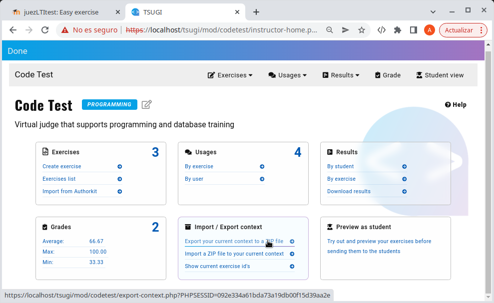
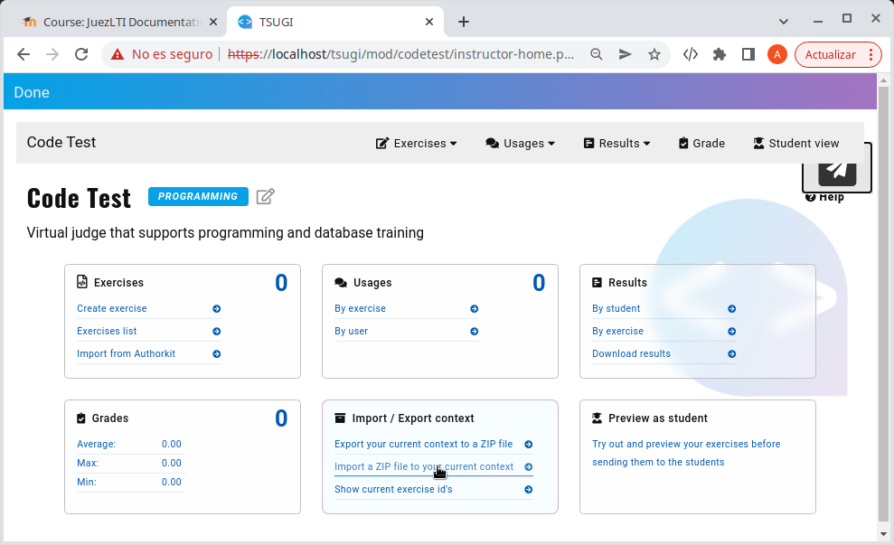
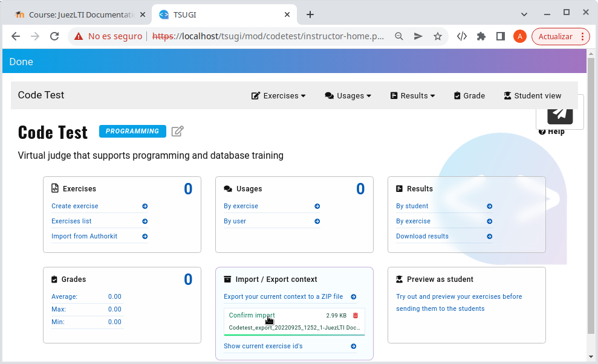

# Backup and restore

Instructors could export the context (activity) with the exercises is composed to import it into a different activity or LMS.

The steps to do it would be the next:

1. Export the context to a zip file, selecting the option showed in the image below.

2. Create a new activity in the LMS as explains the _[Using In Moodle](usingInMoodle.md)_ chapter.
3. Open activity and access to _Teacher View_
4. Import the zip file previously downloaded into the current context.

5. Confirm the import.

At the end, you will see as the number of exercises has changed and is increased until the number of the exercises belongs to the original context. 
