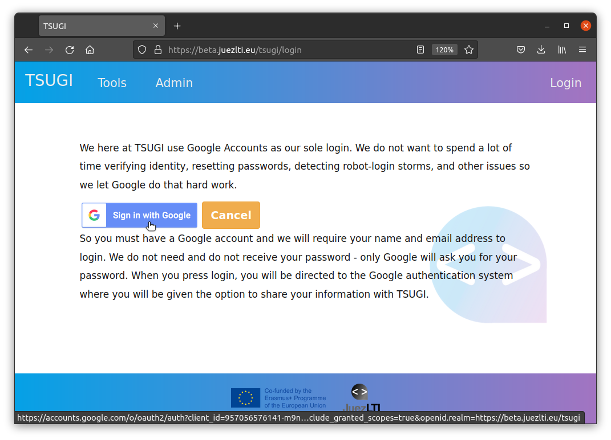
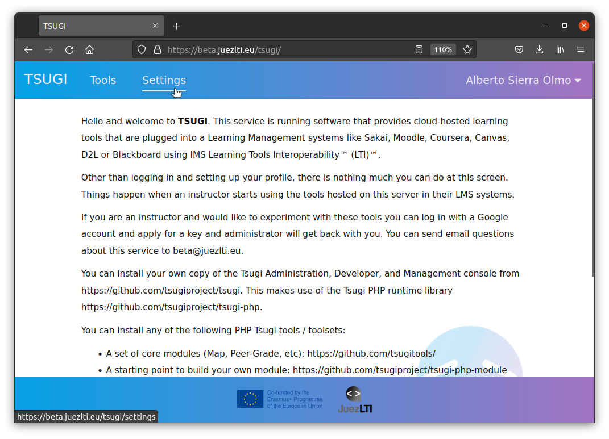
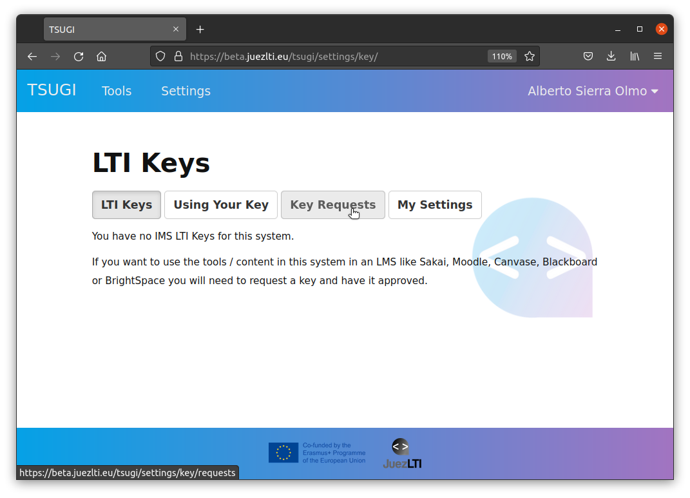
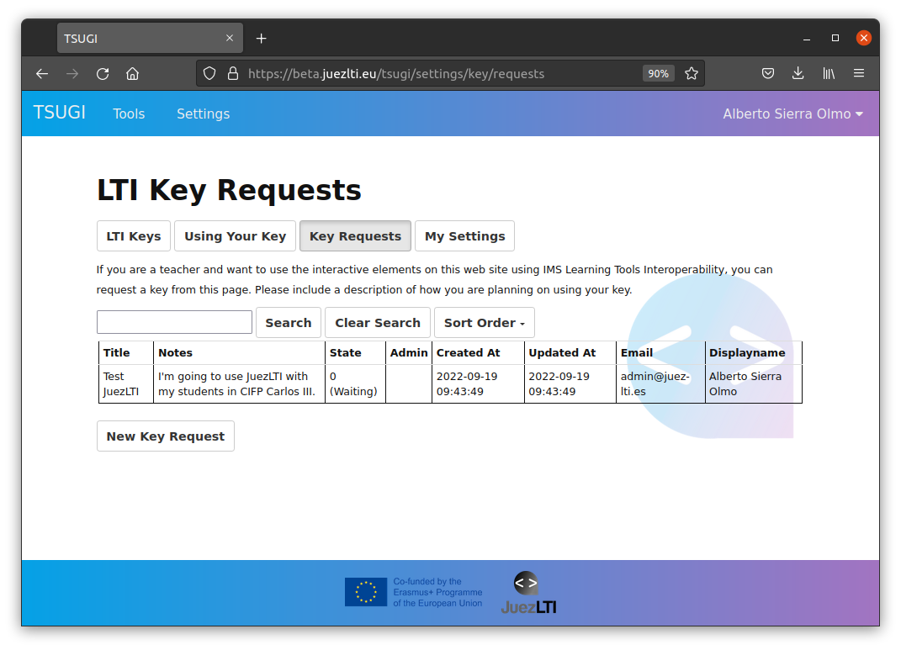

# Getting Credentials
To secure message interactions between the LMS and JuezLTI OAuth protocol is used. OAuth signing requires a **key** and shared **secret** to sign messages.  The key is transmitted with each message, as well as an OAuth-generated signature based on the key. JuezLTI looks up the secret based on the provided key and re-computes the signature and compares the recomputed signature with the transmitted signature to verify the sender's credentials.

The procedure to get the key and secret includes:
- [Getting Credentials](#getting-credentials)
  - [JuezLTI authentication](#juezlti-authentication)
  - [Key/secret request](#keysecret-request)
  - [Authorization by JuezLTI admin](#authorization-by-juezlti-admin)
  - [Key/secret sent](#keysecret-sent)

These steps are showed in the image below:

## JuezLTI authentication

JuezLTI uses [Tsugi](https://www.tsugi.org) to manage key/secret requests and Tsugi requires authentication with your Google Account. Then, go to the [JuezLTI Tsugi page](https://beta.juezlti.eu/tsugi/) and click on Login as the images below show:

The Google account selected will receive the key/secret credentials.

After Google authentication, a profile page will be showed and you will be able to choose your profile settings and Save them clicking on **Save** or **Save Profile Data** button:

## Key/secret request

Once you are authenticated, click on Settings

If this is your first request, you will see a (0) close to **Manage LMS Access Keys** item. Click on **Manage LMS Access Keys**

LTI Keys button appears selected and the message _"You have no IMS LTI Keys for this system."_ below.

Click on **Key Request** button

And, then, on **New Key Request**

Fill in the form and explain why or where you are going to use the credentials, please.

A new key with state (**Waiting**) has been requested.

## Authorization by JuezLTI admin

An email has been sent to JuezLTI staff and as soon as possible, the key request will be approved. At that moment, you will receive an email with the confirmation in your google account.

## Key/secret sent

When you receive the approval confirmation email, you will be able to login again and the approved key will be showed into **LTI Keys** section.

