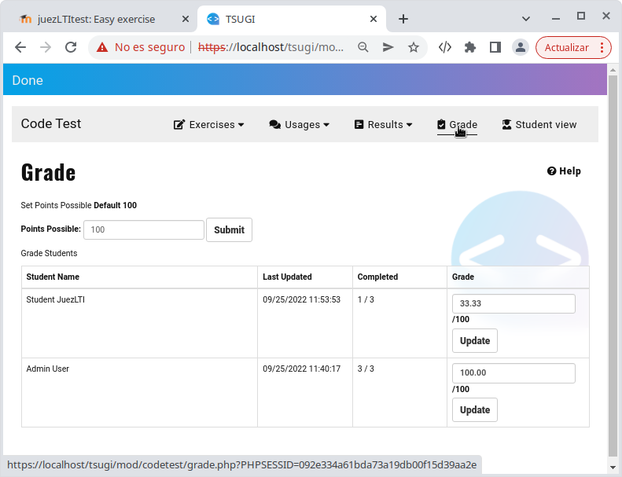
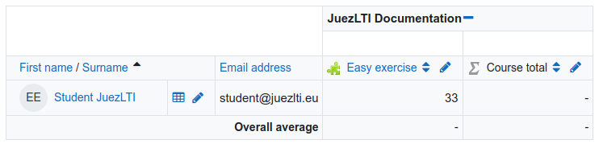
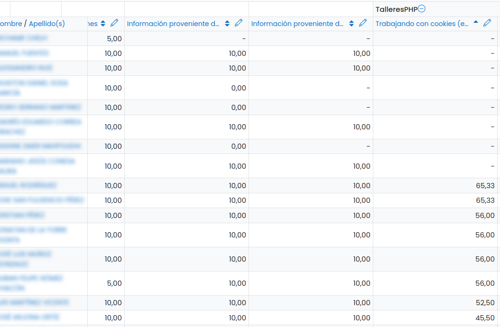

# Reviewing results

Instructors have two places where they could review the results of students:

  - [Reviewing results in Teacher View](#reviewing-results-in-teacher-view)
  - [Reviewing results in Grade LMS](#reviewing-results-in-grade-lms)

## Reviewing results in Teacher View

Instructors can follow the activity of their students in the menu _Results_.

Below, the list of exercises solved by _Student JuezLTI_ is showed:

As you can see, that student has solved only one of the three exercises proposed in the activity and clicking on _SHOW CODE_ button the instructor could see his answers.

Then, in _Grade_ menu instructor could view the grade obtained by the student.

The image below shows how 33.33% is the grade obtained by _Student JuezLTI_ in the activity.

JuezLTI allows the instructors to modify the grade of any student, changing the value in the text box and clicking on _Update_ button.

## Reviewing results in Grade LMS

Remember that the grade obtained on JuezLTI is sent to LMS using LTI standard. So, the same grade that the instructor could see in JuezLTI could also be seen in LMS.

In the real scenario below, the instructor allows the students to go forward in different speeds and he could see where the students find more difficulties and who needs more help.

## Download results

A spreadsheet with students' results is also available for downloading.
