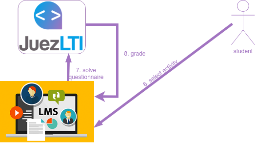
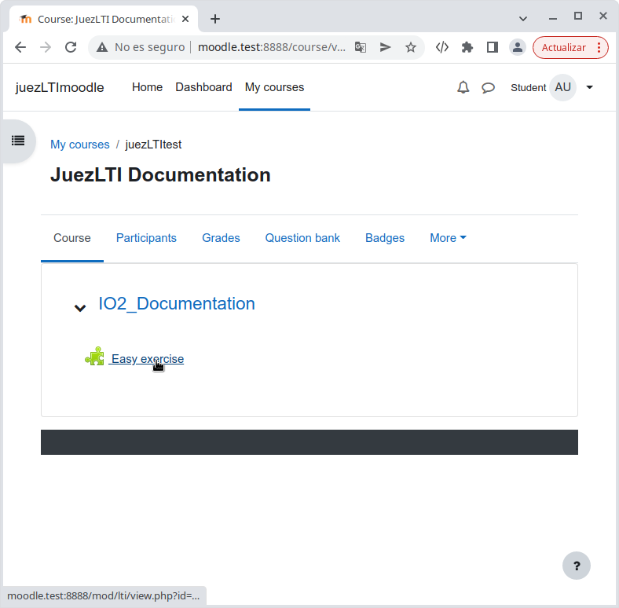
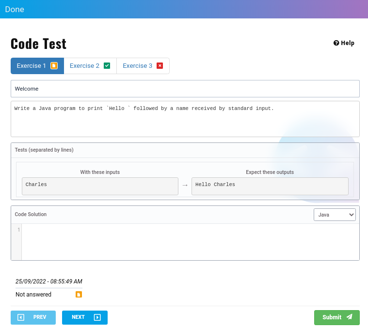
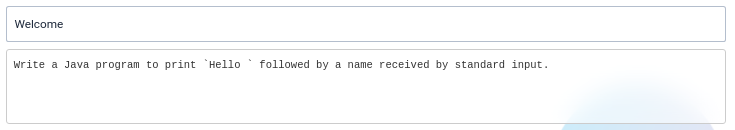
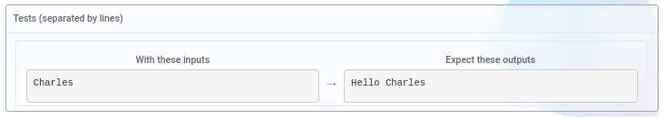
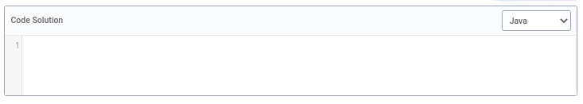
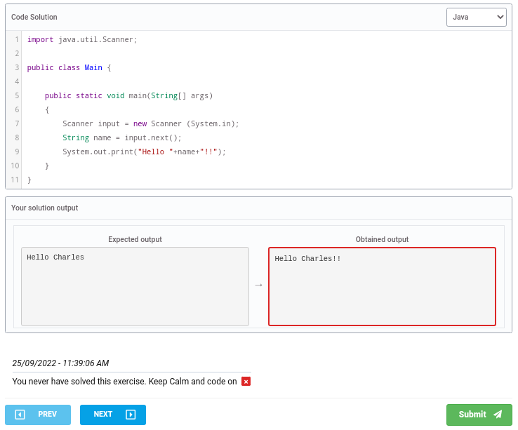
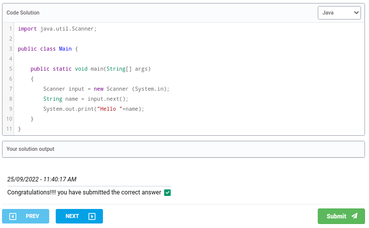

# Student View



Once instructors have created the **external tool activity**  or , students could see it in their course page:



Student only need click on the External Activity. In this case, _Easy exercise_

A Student View similar to the image below appears:


On top of the page, the list of exercises that compose the activity is showed:


Example above shows an activity composed by three exercises, in one of the three possible states each:

- _orange_: the student didn't answer the exercise.
- _green_: the student solved the exercise.
- _red_: the student launched a wrong answer to the exercise.

Student can use the list of exercises to navigate thought the exercises, clicking on them.

After the list of exercises, the exercise's title and statement is found



and the set of tests



In those tests, student can view the output that corresponds each input. In the example above, if the code receives `Charles` it must return `Hello Charles`.

The student must code his solution on _Code Solution_ field, selecting previously in wich language will be coded the solution:



At bottom of the page the student will receive the grade and feedback of his answer.

Above, you can view the result of two different codes:

- Wrong answer:

```
import java.util.Scanner;

public class Main {

    public static void main(String[] args)
    {
        Scanner input = new Scanner (System.in);
        String name = input.next();
        System.out.print("Hello "+name+"!!");
    }
}
```


- Right answer:

```
import java.util.Scanner;

public class Main {

    public static void main(String[] args)
    {
        Scanner input = new Scanner (System.in);
        String name = input.next();
        System.out.print("Hello "+name);
    }
}
```


