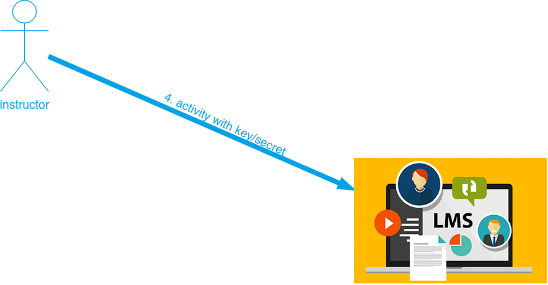

# Using JuezLTI in Moodle

From Moodle 2.2 onwards, the **External tool** enables users to interact with LTI-compliant learning resources and activities on other websites. Then, the **External tool activities** are the right way to use JuezLTI from Moodle.

Next, there is a summary of the [External tool](https://docs.moodle.org/400/en/External_tool) documentation in Moodle official site.

Depending on your privileges in your Moodle institution site, you will be able to configure the LTI tool at activity level or at site administration level

## Activity level

Once you have selected the **external tool activity**  or  you have to fill in the form:

- **Activity name** -  add a title, description if required, with your choice of display.
- **Preconfigured tool** - this is how Moodle communicates with the tool provider. If in doubt, leave as default. If your administrator has made a tool available site-wide, you will be able to select it here:

- **Tool URL** - This is the URL for connecting to site. If your moodle site uses [SSL](https://en.wikipedia.org/wiki/Transport_Layer_Security) (is on [HTTPS](https://docs.moodle.org/400/en/HTTPS)) you will only be able to use a tool that also uses [SSL](https://en.wikipedia.org/wiki/Transport_Layer_Security). Make sure the tool URL has [HTTPS](https://docs.moodle.org/400/en/HTTPS) before attempting to use it or you may get a blank page.

    In the beta of JuezLTI the URL must be filled with [https://beta.juezlti.eu/tsugi/mod/codetest/](https://beta.juezlti.eu/tsugi/mod/codetest/). _Don't forget the final /_.

- **Launch container**- this is how the external tool will be displayed.
    - Default - if in doubt; leave as default
    - Embed - the external tool will be embedded in the Moodle course page with blocks and navigation bar
    - Embed without blocks - the external tool will be embedded in the Moodle course page but without blocks
    - New Window - the external tool will open in a new window. (A new window or tab will open with the External tool and the old browser window containing the course page will not change.)

_The following settings are available by clicking ""Show more":_
- **Activity description** - give a short description here
- **Display description on course page** - choose to show the description along with the activity name
- **Display activity name when launched** - have this appear when the student clicks the link.
- **Display activity description when launched** - have this appear when the student clicks the link.
- **Secure tool URL** - This overrides the tool URL when moodle uses [SSL](https://en.wikipedia.org/wiki/Transport_Layer_Security) (if your site is configured to use [HTTPS](https://docs.moodle.org/400/en/HTTPS) in the wwwroot)
- **<u>Consumer key</u>** - here is where you must paste the [**key** issued from JuezLTI](gettingCredentials.md).
- **<u>Shared secret</u>** - and here, the **secret**.
- **Custom parameters** - most times you can leave this blank. The tool provider might use this to allow you to display a specific resource.
- **Icon URL** - you can display a different icon from the default External Tool icon by entering its URL here
- **Secure Icon URL** - enter the URL of a different icon here if your students are accessing Moodle securely via [SSL](https://en.wikipedia.org/wiki/Transport_Layer_Security).

## Privacy

- **Share launcher's name with the tool** - this means that the student's name will be displayed on the connected site [as in this example](https://docs.moodle.org/400/en/images_en/1/13/demoexternaltool.png)
- **Share launcher's email with the tool** - this means that the student's email will be displayed on the connected site [as in this example](https://docs.moodle.org/400/en/images_en/2/27/externaltoolfrontpage.png)
- **Accept grades from the tool** - if this is checked, the connecting site will send back grades to Moodle's gradebook. See [Using External tool](https://docs.moodle.org/400/en/Using_External_tool) for more information on this.

## Site administration settings

### Adding a tool site-wide

An administrator can manually configure external tools in _Site administration > Plugins > Activity modules > External tool> Manage tools_ so that they are available across the site.

A tool may be configured by an administrator so that it is shown in the activity chooser (in addition to the external tool activity) for a teacher to select to add to a course. Its description, if one is present, will appear in the activity chooser.

### Viewing more details

On the _'Manage tools'_ page you can also visit _'Manage preconfigured tools'_ to view the preconfigured tools in a tabular format.

There are tabs to add an external tool, to view those which are pending and to view those which have been rejected:

You can also visit _'Manage external tool registrations'_ to view the tool registrations in a tabular format, or to add an external registration with limited capabilities.

To add a tool with limited capabilities.
1. Click 'Configure a new external tool registration'

2. Configure the details on the settings page:

_'Memberships'_, allow the external tool to request a list of users with a certain role in a specified context e.g. users enrolled in a course.

3. Click the tick/checkmark to register:

4. After obtaining a success message, click to complete the process:

5. If all requirements are met then you will be able to register automatically.

6. Now go to _Site administration > Plugins > Activity modules > External tool > Manage external tool types_ and click the 'Pending tab'

7. Click the tick/checkmark to activate it:

See the screencast [External tool registration](http://www.spvsoftwareproducts.com/temp/lti2-moodle/) for a demonstration of the above steps.
