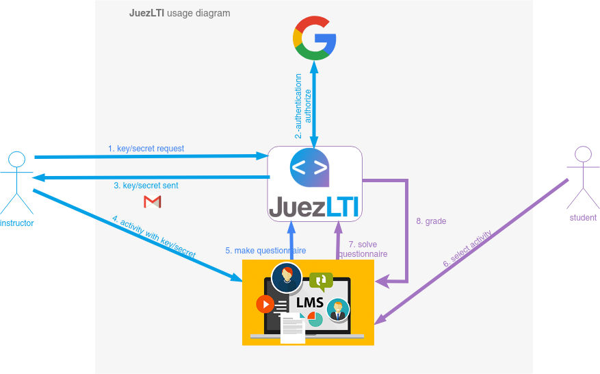

# ¿Qu&eacute; es JuezLTI?
[JuezLTI](https://juezlti.eu) es una herramienta que permite la **calificación automática de ejercicios de computaci&oacute;n**, entre ellos, ejercicios de programaci&oacute;n, bases de datos y lenguajes de marcas. Esta herramienta es innovadora porque provee **interoperabilidad con cualquier entorno de aprendizaje (LMS) como Moodle, Sakai, Canvas o Blackboard** (entre muchos otros) gracias al uso del est&aacute;ndar LTI. Esto, a&ntilde;adido al conjunto de ejercicios desarrollados durante el proyecto le hace una herramienta muy &uacute;til para un gran n&uacute;mero de instituciones educativas, algunas de las cuales han mostrado su inter&eacute;s y apoyan expl&iacute;citamente el proyecto.

La siguiente imagen muestra el diagrama de uso de JuezLTI:
