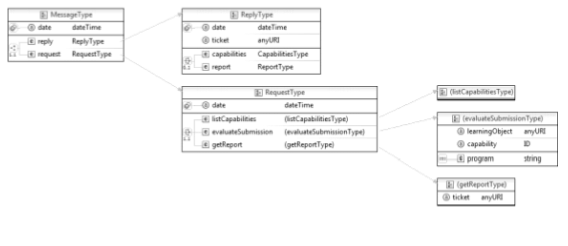

# PEARL 

The **P**rogramming **E**xercise **A**ccessement **R**eport **L**anguage (PEARL) is used to formalize evaluation reports. The three types of request handled by
a service using PEARL are: 

 - `ListCapabilities`: provides the client systems with the capabilities of a particular evaluator;
 - `EvaluateSubmission`: allows the request of an evaluation for a specific programming exercise;
 - `GetReport`: allows a requester to get a report for a specific evaluation using
a ticket. 

The diagram depicted in the
figure above includes two main elements: `request` and `reply`. The former echoes the request function and its parameters as received by the evaluation service and the later contains the output to that request.
The `request` element contains a different sub-element according to the function type. The `reply` element includes two sub-elements representing the possible responses of the service, more precisely, the `capabilities` and `report` elements.
The capabilities element is used in a ListCapabilities response. This element has several capability sub-elements each with several feature elements to describe it. The ticket attribute holds a ticket to recover a report on a later date.
