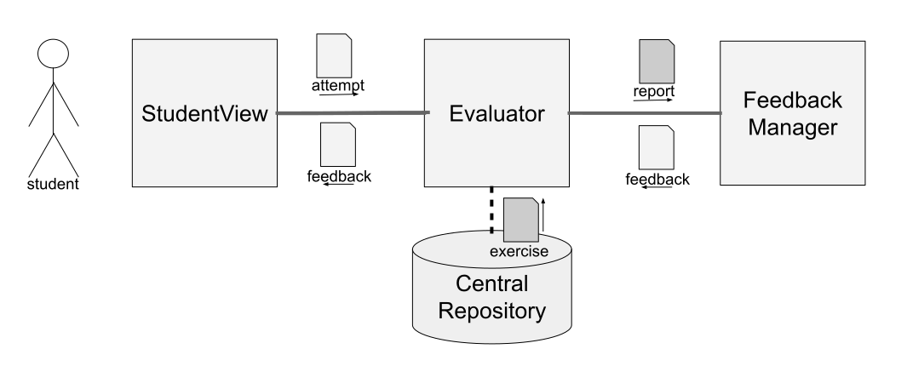

  <a href="README.md">[EN]</a>
  <a href="README_es.md">[ES]</a>
  <a href="README_pt.md">[PT]</a>
  <a href="README_tr.md">[TR]</a>
  <a href="README_sv.md">[SV]</a>

# Internal API

JuezLTI is structured in different modules, as explained in the [Architecture](../Architecture/README.md). Four kinds of modules participate in its structure, namely: 

 - **Student View** - where students attempt to solve exercises;
 - **Evaluator** of student attempts sent by the previous module;
 - **Feedback Manager** - processes reports generated by evaluators to produce meaningful  messages; 
 - **Central Repository** - containing exercises and other configurations

 It should be noted that while most of these participants are singletons, the **Evaluator** is a kind of module with several instances. There is a programming language evaluator, a markup languages evaluator, and database evaluator.

The following diagram illustrates the communication among these modules. Using the **Student View**,  a student submits an attempt to an **Evaluator**. This component assesses this attempt using an exercise retrieved from the **Central Repository** and produces a **report**. The evaluator submits the report to the **Feedback manager** to produce a **feedback** that is returned to the **StudentView** and presented to the student.  This communication among the modules is regulated by an internal [API fornalized in Swagger](https://github.com/JuezLTI/APIs/blob/d981488ba77f238f2aaeb6f862ab1c2a0e8252d9/v2/API.yaml#L16).

Most of the data commun