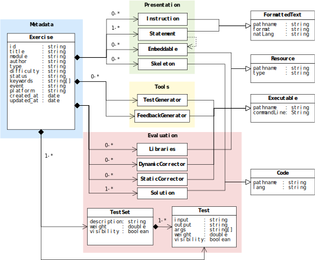

## YAPExIL

**Y**et **A**nother **P**rogramming **Ex**ercises **I**nteroperability **L**anguage (YAPExIL) is a language for describing programming exercise packages, partially based in the XML dialect PExIL (**P**rogramming **Ex**ercises **I**nteroperability **L**anguage). In comparison to PExIL, YAPExIL (1) is formalized through a JSON Schema instead of a XML Schema, (2) removes complex logic for automatic test generation while still supporting it through scripts, (3) supports different types of programming exercises and (4) adds support for a number of assets (e.g., instructions for authors, feedback generators, and platform information).

YAPExIL aims to consolidate all the data required in the programming exercise life-cycle, including support for seven types of programming exercises:

 - `BLANK_SHEET` provides a blank sheet for the student to write her solution source code from scratch;
 - `EXTENSION` presents a partially finished solution source code (the provided parts are not subject to change by the student) for the student to complete;
  - `IMPROVEMENT` provides correct initial source code that does not yet achieve all the goals specified in the exercise specification (e.g., optimize a solution by removing loops), so the student has to modify it to solve the exercise;
  - `BUG_FIX` gives a solution with some bugs (and, possibly, failed tests) to foster the student to find the right code;
  - `FILL_IN_GAP` provides code with missing parts and asks students to fill them with the right code;
  - `SPOT_BUG` provides code with bugs and asks students to merely indicate the location of the bugs;
  - `SORT_BLOCK` breaks a solution into several blocks of code, mixes them, and asks students to sort them.

To this end, the YAPExIL JSON Schema can be divided into four separate facets: *metadata*, which contains simple properties providing information about the exercise; *presentation*, which relates to what is presented to the student; *assessment*, which encompass what is used in the evaluation phase; and *tools*, which includes any additional tools that the author may use in the exercise.

The following figure presents the data model of YAPExIL format, with the area of each facet highlighted in a distinct color. The next subsections describe each each of these facets.

## Metadata Facet

The Metadata facet, highlighted in blue in the figure, encodes basic information about the exercise that can uniquely identify it and to which subject(s) it refers to. Elements in this facet are mostly used to facilitate searching and consultation in large collections of exercises and the interoperability among systems. For instance, an exercise can be uniquely identified by its `id`, which is a Universally Unique Identifier (UUID) of the exercise.

Furthermore, the metadata includes many other identifying and non-identifying attributes such as the `title` of the programming exercise, the `module` in which the exercise is in (i.e., a description of its main topic), the name of the `author` of the exercise, a set of `keywords` relating to the exercise, its `type` -- which can be `BLANK_SHEET`, `EXTENSION`, `IMPROVEMENT`, `BUG_FIX`, `FILL_IN_GAPS`, `SORT_BLOCKS`, or `SPOT_BUG` --, the `event` at which the exercise was created (if any), the `difficulty` (one of `BEGINNER`, `EASY`, `AVERAGE`, `HARD`, or `MASTER`), the current `status` (i.e., whether it is still a `DRAFT`, a `PUBLISHED` or `UNPUBLISHED` exercise, or it has been moved to `TRASH`), and the timestamps of creation and last modification (`created_at` and `updated_at`, respectively).

## Presentation Facet

The Presentation facet, highlighted in green in the above igure, includes all elements that relate to the exercise visualization, both by the students and the instructors. More precisely, these will be the elements placed on the screen while the student solves the problem, and when the teacher firstly opens the exercise.

The supported elements include `instruction` -- a formatted text file with instructions to teachers about how to deliver or some remarks on the exercise --, `statement` -- a formatted text file with a complete description of the problem to solve --, `embeddable` -- an image, video, or another resource file that can be referenced in the statement --, and `skeleton` -- a code file containing part of a solution that is provided to the students, from which they can start developing theirs. 

All of these elements are allowed multiple instances, being required only a single statement in this facet to have a complete exercise. Hence, formatted text files may be translated to other natural languages or formats whereas code files can be written in several programming languages.

## Assessment Facet

The automated assessment is the end goal of a programming exercise definition language. In order to evaluate a programming exercise, the learner must submit the source code to an evaluation engine. The evaluation engine will then use the necessary and available elements to judge it. 

All the elements used in the evaluation belong to the Assessment facet, highlighted in red in the above figure, and include `template` -- code file containing part of a solution that wraps students' code without their awareness --, `library` -- code library that can be used by solutions, either in compilation or execution phase --, `static_corrector` -- external program (and associated command line) that is invoked before dynamic correction to classify/process the program's source code --, `dynamic_corrector` -- external program (and associated command line) that is invoked after the main correction to classify each run --, `solution` -- a code file with the solution of the exercise provided by the author(s), `test` -- a single public/private test with input/output text files, a weight in the overall evaluation, and a number of arguments --, and   -- a public/private set of tests.

Each element in this facet also supports multiple instances, being required only a single solution and either a test or a testset with one test. Hence, multiple correctors, libraries, and test/testsets, and solutions in different programming languages may be provided.

## Tools Facet

The Tools facet, highlighted in yellow in above figure, encompasses any additional scripts that may be used during the programming exercise life-cycle. These include external programs (and their associated execution command line) that generate (1) the feedback to give to the student about her attempt to achieve a solution (i.e., `feedback_generator`) and the test cases to validate a solution (i.e., `test_generator`).

