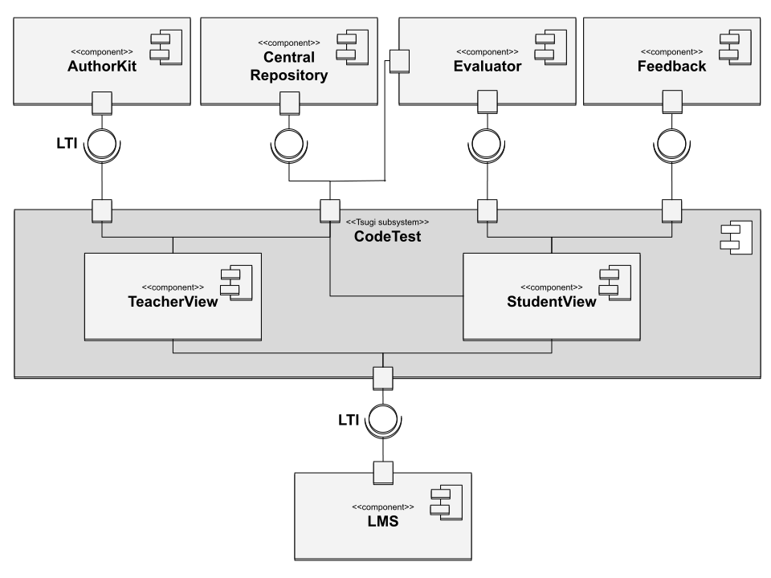

  <a href="README.md">[EN]</a>
  <a href="README_es.md">[ES]</a>
  <a href="README_pt.md">[PT]</a>
  <a href="README_tr.md">[TR]</a>
  <a href="README_sv.md">[SV]</a>

## Arquitetura do JuezLTI

O objetivo do JuezLTI é permitir a avaliação de exercícios numa grande variedade de linguagens usadas em computação, dentro do LMS.
Para atingir este objetivo, o JuezLTI combina as seguintes caraterísticas: 
1. a interoperabilidade com o LMS fornecida pelo *framework* TSUGI;
2. um design modular que permite a incorporação de avaliadores para novos domínios;
3. um sistema de *feedback* genérico para ajudar os alunos a superar suas dificuldades;
4. um repositório centralizado de exercícios de onde podem ser exportados e importados.

A arquitetura do JuezLTI é representada pelo diagrama de componentes UML na figura acima.
No centro dessa arquitetura está o CodeTest, o principal componente baseado em TSUGI, o *framework* que fornece suporte a LTI,
e seus subcomponentes **TeacherView** e **StudentView**.
O primeiro é um ambiente web onde o professor configura a atividade adicionando exercícios de um repositório central.
Este último é um ambiente web onde o aluno tenta resolver os exercícios propostos.

O componente baseado em TSUGI conta com vários tipos de componentes descritos na parte superior do diagrama. 
Da esquerda para a direita são **Autorkit**, **Central Repository**, **Evaluator** e **Feedback**.
O **AuthorKit** é um sistema de autoria de exercícios que pode ser usado por professores para criar exercícios para JuezLTI. 
O repositório central funciona como um conjunto de exercícios para o sistema.
O componente avaliador executa o código dos alunos e verifica os resultados.
Por fim, o sistema de feedback fornece informações sobre o resultado da resolução do exercício.

O JuezLTI é um projeto de código aberto distribuído sob uma licença Apache 2.0.
Pode ser instalado nos servidores de qualquer instituição e configurado para se comunicar com o Learning Management System da instituição.
Está disponível no GitHub em duas formas diferentes: produção e desenvolvimento.
O primeiro permite a implantação de todo o sistema (vários componentes *docker*) em um servidor de produção aberto à Internet.
Com este último, qualquer pessoa pode construir a plataforma localmente e contribuir para o desenvolvimento do JuezLTI.

