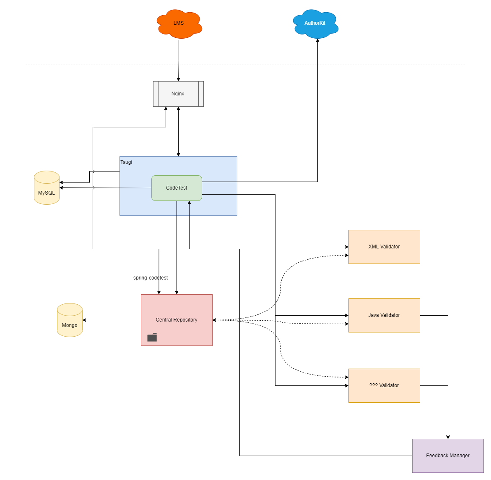
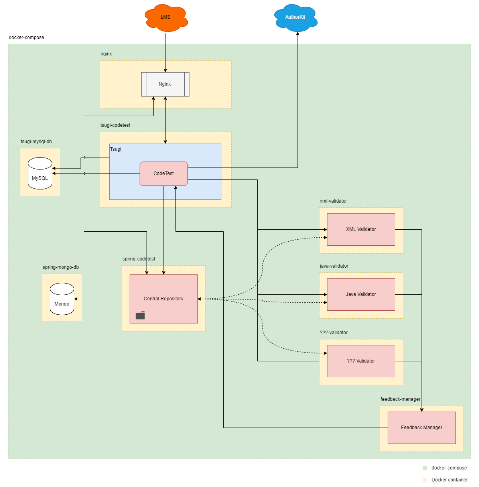
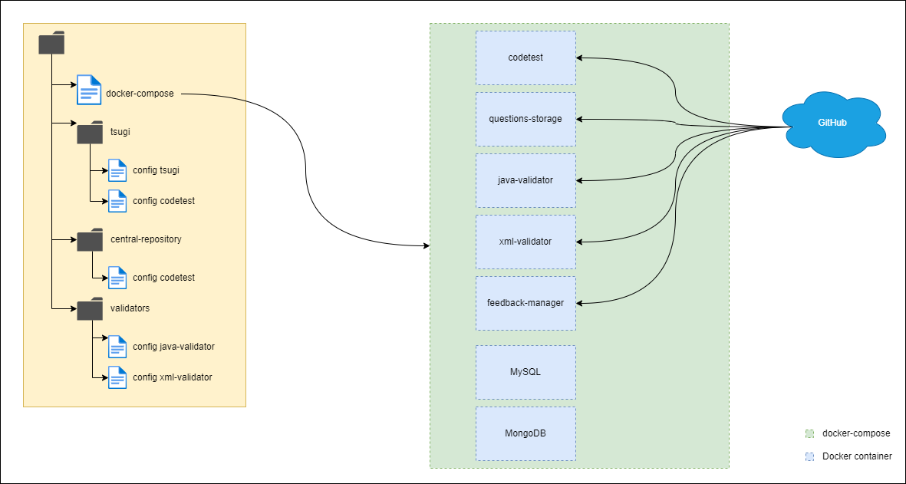
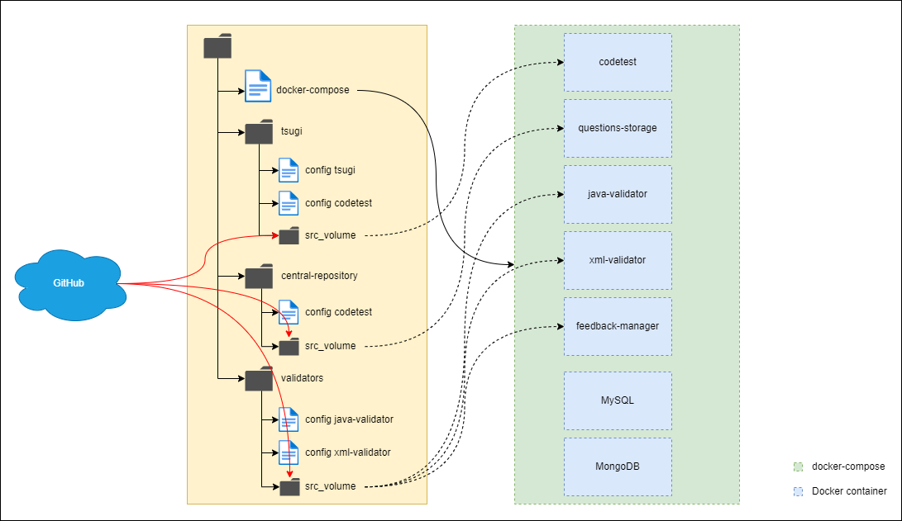

  <a href="../en/README.md">[EN]</a>
  <a href="../es/README.md">[ES]</a>
  <a href="../pt/README.md">[PT]</a>
  <a href="../tr/README.md">[TR]</a>
  <a href="../sv/README.md">[SV]</a>

# JuezLTI architecture
JuezLTI is composed of different interconnected modules, each of them with a specific purpose. In the following image we can see different elements that make it up.

 

Image 1

 

- Nginx (Frontal/Proxy): It is the entry/exit point of our system. Allows to make the internal network independent from the outside. It exposes only the desired ports and contexts, making it easier to manage the security of the entire environment. It is also responsible for managing HTTPS connections.

- Tsugi + Codetest (Frontal Web): The visible face of our system. It allows both teachers and students to interact with the exercises/questions. Codetest (the essence of the web front-end) is a module within Tsugi, which facilitates all the management of the LTI standard.

- BD MySQL: Database where everything related to Tsugi and Codetest will be stored.
Central Repository (Repository + API): Here all the exercises are stored centrally and globally. This component supplies data to the web front end, to the validation system (see below) and exposes a Rest API that can be consulted externally.

- BD Mongo: Database with information related to the exercises and their use.
Validators (Java, XML, SQL...): Dynamic and undefined set of components dedicated to the validation of the exercises. Basically, for an exercise and a user's answer to that exercise,  will return if it is correct or incorrect.
Feedback Manager (Response Normalizer): Returns a normalized response to the web front end.

 

Our system needs/makes use of two other external elements:

- AuthorKit (Exercise Generation/Management): Before JuezLTI was self-sufficient in exercise creation and management, AuthorKit was used as an external exercise provider platform. Nowadays, it is no longer essential but still being a valid option.

- LMS (Moodle, Sakai, Canvas, Blackboard…): Since JuezLTI is intended as an LTI tool, an LMS is needed to import and make use of it.

  

# Online Repositories
Where is the source code, how is it organized?
All the source code for JuezLTI can be found at [GitHub](https://github.com/JuezLTI)

#### GitHub is an online platform that offers the possibility to store and manage repositories and version control of software projects. These repositories can be private or publicly exposed.

In our case, since we are working on an OpenSource project (collaborative and public), the choice of GitHub is trivial. Not only does it allow us to share and delimit the different changes and improvements among the different participants of the project, it also gives us the possibility to manage different branches or versions of the project as needed.

As we saw before, JuezLTI is composed of different elements. Each of these elements has its own repository on GitHub:

- [Tsugi](https://github.com/JuezLTI/tsugi)

- [Codetest](https://github.com/JuezLTI/codetest)

- [Central Repository](https://github.com/JuezLTI/questions-storage)

- [Feedback Manager](https://github.com/JuezLTI/feedback-manager)

 

### Validators:
######  - [Java Evaluator](https://github.com/JuezLTI/java-evaluator)
######  - [XML Evaluator](https://github.com/JuezLTI/xml-evaluator)
######  - [SQL Evaluator](https://github.com/JuezLTI/sql-evaluator)

 

There is also an additional repository that is of particular importance.
It name is [<strong>deploy_docker</strong>](https://github.com/JuezLTI/deploy_docker).
This repository contains everything needed to deploy and run the entire JuezLTI platform automatically thanks to Docker technology.

 

# Deployable modules with Docker

Docker is an open source system for managing application containers. Each container can virtualize a completely different and independent environment and operating system, offering what is called a SandBox.

This container system greatly facilitates its deployment and modularization on any platform.
Thanks to this technology we will encapsulate each of the components of the project in an independent container, all of them interconnected within the same network/project of the Docker composer.

If we remember the original structure of JuezLTI (image 1), we can now see how it looks like after configuring it with Docker:

 

Image 2

 
 

## Full deployment

if you download the "deployment" branch from the repository “[<strong>deploy_docker</strong>](https://github.com/JuezLTI/deploy_docker)” in our computer we will have the following directory structure (highlighted in yellow):

 

Image 3

 

the "docker-compose" file contains the necessary configuration to run each and every one of the components that make up the system.

To start the Docker environment and all its components, just run the command "docker-compose up" from the root of the project.

Docker will make use of the different configuration files organized by folders to configure each container/component. When you start a Docker container, it will automatically download its source code from its GitHub repository, compile, configure and run it. 

 

## Modular deployment

On the other hand, is possible to separate the components and configure them separately. In this case, the ports and addresses of the different components must be configured manually in order to communicate with the others components.

The only component that should not be deployed is the <strong>central repository</strong>, this component must be unique and globally known.

  
  
## Development deployment
  

Image 4

 
 
For the test environment, in GitHub we have the "master" branch of the "deploy_docker" repository. If we download this branch we will get a directory similar to the one we saw previously with the full deployment. In this case the difference is that we will have the source code of each component locally.
 
To download the source code just run the "clone-repos" script included in the root of the project.

To run the project, we will do the same as before using the command "deploy-docker up". In this case Docker will not download anything, it will simply mount the containers using the code from the directories available in our local project.
This allows us to make modifications and customizations in a much easier way.
  
 
  
# SETUP OF THE WORKING ENVIRONMENT
  
   
  
### DEPLOYMENT
  
As mentioned above, the project has a docker-compose file with everything needed to run a functional instance of JuezLTI. Of course it is a fundamental requirement to have both Docker and docker-compose installed on the system.

 
  
Each component that makes up JuezLTI has its own requirements:

 
- [ Apache 2.4.46 ] - [ PHP 7.3.21 ] For the installation of Tsugi - Codetest
  
- [ Java 8 ] - [ MongoDB ] For installation/use of question repository ( questions - storage , SpringBoot )
  
- [ MySQL 5.7 ] Used by Tsugi - Codetest
  
- [ Node.js 16.13.2 ] Used by validators and feedback-manager

 
  
First of all, it is necessary to copy the '.env.example' file and rename it as ".env ". Inside this file we can configure the different variables/tokens needed to access to the GitHub repositories and to configure the different access points (domain, port, user, password) for each of the components.
  
Once the ".env" file is configured, if we launch the command "docker-compose up", the whole Docker deployment process will be initialized. Once the process is finished, we will have a functional instance of JuezLTI. 
  
If we need to specifically update/reboot one of the components, we can do it using the command "docker-compose build --no-cache --force-rm <service-name>" using that command, we will rebuild the Docker container with the new information from GitHub.
To recompile and restart the whole system with the latest version available in the GitHub repositories, we can use the script "deploy.sh" that is available in the root directory.

 
  
### DEVELOPMENT:
  
It consists of the same elements as the deployment environment and therefore also needs to copy and configure the variables/token from the "env.example" file.

In the root directory we will find a script called clone-repos (Windows: clone-repos.bat, Linux: clone-repos-sh), which will clone all the necessary repositories for JuezLTI in our local directory.
  
In order to be able to access our local system via HTTPS, we will need to create a self-signed SSL certificate. Explained in detail in [generate_certs.md](https://github.com/JuezLTI/deploy_docker/blob/master/generate_certs.md).
  
   
  
The generated certificate ( [ "yourkey".key ] - [ "yourKeyCert".crt ]) must be copied into the local directory ./nginx/certs. After that, it will be necessary to edit the file ./nginx/default.conf.template and modify the following parameters:
  
- ‘ssl_certificate_key’ -> ssl_certificate_key /opt/certs/(yourKey).key;
  
- ‘ssl_certificate’ -> ssl_certificate /opt/certs/(yourKeyCrt).crt;

After this, we can boot the system as usual using the "deploy-docker up" command.
  
 
 
#### Utilities:
  
- There are different scripts (at the moment only for Windows) that allow us to recompile and restart the different components individually. They are called compile_XXX.bat. Obviously, compile_all.bat does it for all components.
  
- If we execute the command "docker-compose up -d" it will mount the docker environment but showing by console all the details of the containers to see any conflict in the process.

- To restart a container you can use the command "docker-compose build --no-cache --force-rm <service-name>.”
  
- For the debug of the central repository (SpringBoot) we can use a remote debugger that accesses the SpringBoot docker container to see possible errors or traces that we put in the code.
